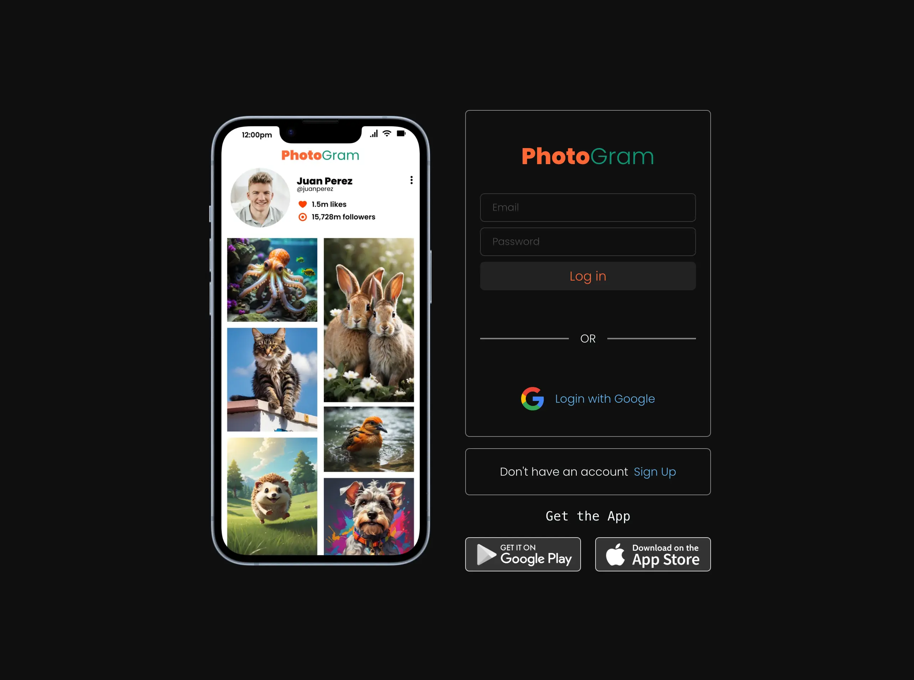
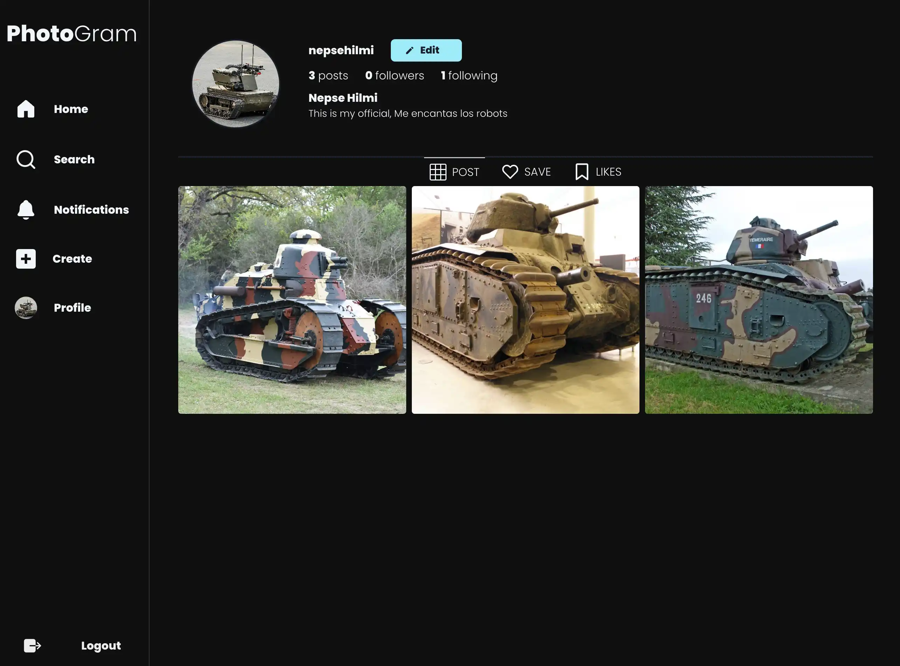
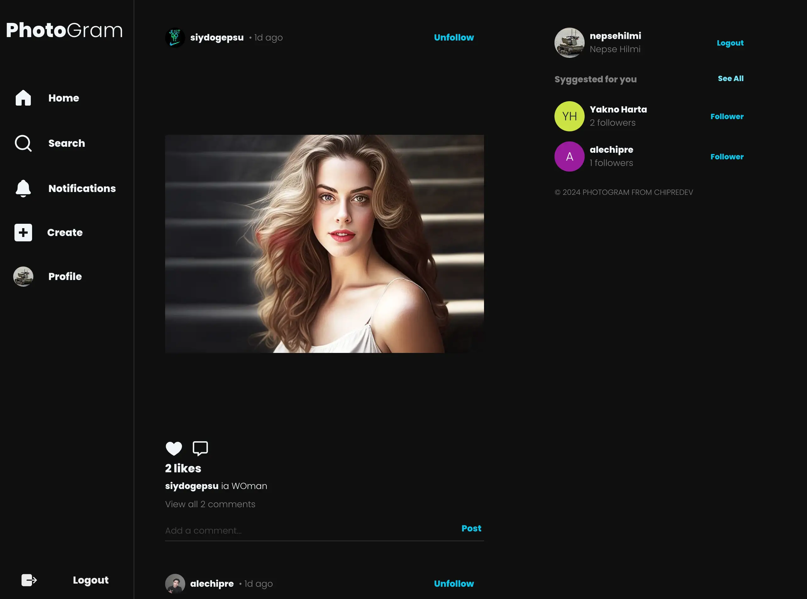

# Page Clone Instagram

## Login Page

  

## Profile Page

## Home Page

  

  
This is a project that I following a web curse of Freecodecamp <a href="https://photogram-clone.netlify.app" target="_blank">Aqui</a> encuentra la pagina web
  

  

    
  

## Descripción

This page use many technologies in programation:

React - Library Javascript: 
[Link](https://react.dev/) 

Statically Analyzes: 
[Link](hhttps://eslint.org/) 

ChakraUI - Components: 
[Link](https://chakra-ui.com/) 

ChakraUI - Icons: 
[Link](https://chakra-ui.com/docs/components/icon) 

Fontsource - Tipography: 
[Link](https://fontsource.org/) 

Firebase - Auth, Storage, Database: 
[Link](https://firebase.google.com/) 

React Router Dom - Router:
[Link](https://reactrouter.com/en/main) 

React Icons - Library of Icons: 
[Link](https://react-icons.github.io/react-icons/) 

React Firebase Hooks - Library of implements Auth of firebase: 
[Link](https://github.com/CSFrequency/react-firebase-hooks) 

Zustand - Manage store Global:
[Link](https://zustand-demo.pmnd.rs/) 

## Socials

- Website - [https://chipre.netlify.app/](https://chipre.netlify.app/)
- Linkedin - [@alexchipre](https://www.linkedin.com/in/alexchipre/)
- Twitter - [@chipredev](https://twitter.com/chipredev)
- Instagram - [@chipredev](https://www.instagram.com/chipredev/)

